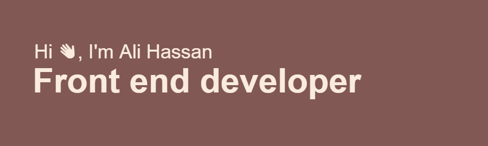

  

###

Connect with me:

###

  
  
  
  

###

  

###

<h3 align="center">A passionate frontend developer from Egypt</h3>

###

<h1 align="center">hey 👋, I'm Ali Hassan</h1>

###

- 🔭 I’m currently learning NextJs - 📚 Ask me about Website development  - ⚡  How to reach me aliihassan8090@gmail.com

###

<h3 align="left">🛠 Language and tools</h3>

###

  
  
  
  
  
  
  
  
  
  
  
  
  
  
  
  
  

###

<h3 align="left">🔥   My Stats :</h3>

###

  
  

###

  

###
